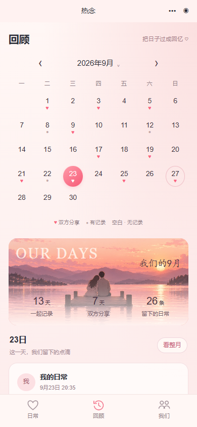

# 发布验收记录 · 2026-09-27

状态：**自动化验收通过；真实环境待验收，暂不合并或发布。**

## 基线与已完成验证

- 修复分支：`fix/audit-followups-2026-09-27`；功能基线：`ff7252715f4a7873379a1c4d9efe2bbac730c040`。
- 本次获取的远端 main：`88d8d76361982b76d7c12a47e2474ec9af76a3c5`。这只是仓库基线，不能据此认定线上部署版本。
- 源码检查：39 JS、21 JSON、8 页面路由、WXML handler 和 38 个 API action 对应关系通过。
- `node --test tests/renian-api/*.test.js tests/frontend/*.test.js`：83 项通过、0 失败。
- Windows PowerShell 5.1：preflight-compat、native-json-argv 两项通过。
- 功能基线 [GitHub CI](https://github.com/Jiac0726/girlfri/actions/runs/36310278391) 通过；收尾提交的 CI 以 PR 当前提交检查为准。
- Playwright：13 个状态 × 320/390/430 px，共 39 项布局检查通过，无横向溢出、按钮裁字、破图和首页主卡重叠。
- 浏览器使用本地构造数据；未连接真实用户数据。原生胶囊、安全区、键盘、订阅弹窗仍待微信验收。

## 视觉与包体

高清背景通过本地 JPEG 导出控制体积。功能基线全部 tracked 文件为 1,460,787 字节，前端目录候选文件为 1,177,853 字节；这是未编译源文件统计，不是微信上传包大小。验收截图、测试和脚本目录通过 `packOptions.ignore` 排除。配置格式参考[微信官方示例](https://github.com/wechat-miniprogram/ai-mode-demo/blob/master/project.config.json)。必须在开发者工具“代码依赖分析/上传”查看实际包体，记录结果后才能勾选包体验收；本地加载成功不代表弱网性能通过。

## 仓库配置核对及待验收项

| 项目 | 代码期望 | 实际环境结果 |
|---|---|---|
| AppID / 云环境 | 本地配置指向同一小程序与 CloudBase 环境 | 用户已提供并写入 Git 忽略的本机配置，configured=true；CLI 可访问指定环境，AppID 与环境关联仍待微信工具核对 |
| 迁移状态 | 已迁移应有 completed 标记；不重跑迁移 | 已只读确认 legacy_v1_to_v2.status=completed，不重跑迁移 |
| 数据库 | 9 集合、16 索引，客户端不可直接读写 | 9 集合可读取索引元数据；v2_query_1～15 名称与字段顺序/方向匹配；缺 v2_query_16；权限规则仍待核对 |
| 云存储 | 客户端仅写本人 v2-upload 暂存路径，发布区服务端签名读取 | 待实际规则与双账号越权验证 |
| 日常提醒 | `tb0gjEGNaTQfOvLVKNdWKekwa3fSTdyCQkkTSpuNjtk`，API 与 worker 一致 | 待核对 AppID 下模板存在及字段匹配 |
| 想念提醒 | `RWnfT0dJaUjWh6e1XsFpLzgeI6naPdDE6Yq1VSbHusw` | 待真实授权与接收 |
| 定时器 | dailyRatingReminderTimer 每 5 分钟；abandonedMediaCleanup 每小时第 17 分钟 | fn detail 返回两个函数的 Triggers 均为空，待补充并核验启用 |
| 操作记录回收 | 保留 90 天，单次最多读取 100 条，跳过迁移标记 | 模拟测试通过；真实日志待验收 |

## 真机执行清单

用 A/B 两个测试账号及一个未绑定账号 C；记录设备、微信版本、基础库版本、体验版版本号、时间及结果，不在仓库保存 OPENID 或真实用户内容。

- [ ] A 创建邀请，B 接受；错误/过期/自邀/重复绑定有明确结果；退出重进关系不变。
- [ ] A 发布文字、评分、图片，B 刷新可见；编辑与删除同步；同日多条记录及跨月回顾正确。
- [ ] 编辑后返回恢复草稿；服务端版本变化不被旧草稿覆盖；上传/确认/发布中断可恢复且无重复数据。
- [ ] 约定、心意券、备忘写入成功后模拟刷新失败，重试仍为同一操作。
- [ ] B 不能编辑 A 的记录或获取 A 的私密备忘图片，C 不能访问双方内容；历史私密记录仍仅作者可见。
- [ ] 提醒初始关闭；主动同意后到点未分享只发送一次；已分享及分享后删除不提醒；拒绝、取消和额度耗尽有明确状态。
- [ ] B 授权想念提醒后 A 发起想念，B 收到一次正确消息；拒绝授权、无额度和发送失败不会伪装成成功。
- [ ] iOS/Android 检查竖版主体、胶囊、安全区、键盘、手动邀请码长页与滚动底部按钮；实际上传包体及弱网首屏通过。

## 发布顺序与回滚

### 云端只读核对结果及待确认修改

2026-09-27 使用已登录的 CloudBase CLI 对用户指定环境读取函数元数据、迁移标记投影和索引，不读取业务内容、不执行任何云端写入。三个正式函数均为 Active、Nodejs16.13、256 MB、超时 3 秒、版本 $LATEST。修改时间（CLI 原始值，未假设时区）：renianApi 为 `2026-09-27 02:43:50`，dailyReminder 为 `02:43:47`，mediaCleanup 为 `02:43:48`。部署时间不能证明线上代码对应哪个 Git 提交。

已下载三个现网函数代码及依赖至 Git 忽略的 `backups/cloudbase/release-2026-09-27/`，保存选定部署参数 `function-metadata.json` 和 17 个源码/配置文件的 SHA-256 清单 `sha256.json`。未导出环境变量、业务数据或执行恢复演练；完整回滚准备仍需核对控制台权限/环境配置。

逐文件比较（统一换行后）：dailyReminder 顶层源码和配置全部一致；renianApi 的 v2.js、v2-media.js 不同，现网缺私密图片容错及媒体申请租约修复；mediaCleanup 的 worker.js、package.json 不同，现网缺 90 天幂等回收且 SDK 版本未统一。其余顶层文件一致。建议重新部署 renianApi、mediaCleanup；dailyReminder 仅需核对权限并更新超时/定时器配置。

生产修改待确认清单：

- 创建缺失的非唯一索引 v2_query_16：v2_operations，createdAt ASC、_id ASC；保留现有索引和数据。
- 核对已下载的云函数备份及控制台配置、确认恢复步骤后，部署经验证的 renianApi、mediaCleanup 代码与依赖。dailyReminder 源码一致，无需为代码差异重复部署。暂不更改运行时版本，先验证现有运行时兼容性。
- renianApi 调整为 60 秒 / 512 MB；dailyReminder、mediaCleanup 调整为 60 秒 / 256 MB。当前 3 秒配置与上传校验及批量工作负载不匹配。
- 确认提醒模板、访问规则和函数版本后，再创建并启用 dailyRatingReminderTimer（`0 */5 * * * * *`）及 abandonedMediaCleanup（`0 17 * * * * *`）。提醒触发器启用后可能向已订阅用户发送消息；清理触发器会实际删除过期媒体及 90 天前幂等记录，因此不在只读核对时启用。
- 小程序上传、合并与正式发布继续等待真机及双账号验收，不随索引/函数配置修改自动执行。

1. 填写下表，保存线上前端、云函数版本及配置；只读确认 V2 迁移状态。未完成 V2 的环境另按迁移文档处理，不纳入自动发布。
2. 已是 V2 的环境：只补缺失索引，尤其 v2_query_15、v2_query_16，等待就绪；核对数据库与存储规则。
3. 部署候选版本 renianApi、mediaCleanup、dailyReminder，选择云端安装依赖；核对函数权限及定时器，不重复添加定时器。生产变更前需确认。
4. 发布体验版完成上表真机验收，记录函数错误、operationsFailed、过期积压及提醒重复情况。任何隐私泄露、重复写入或关键流程失败都停止发布。
5. PR 当前提交 CI 通过、真机结果齐全、回滚点已记录后，再确认合并与正式发布；发布后复验绑定、发布记录、回顾和提醒。
6. 若回归异常，先停止有问题的定时器，再回退相容的前端和云函数版本，恢复保存的配置。保留新增索引及数据，不删除集合、不恢复旧库覆盖新写入；已清理的过期文件/幂等记录不能靠代码回滚恢复。

| 回滚依据 | 实际值（发布前必填） |
|---|---|
| 线上小程序版本 / 对应提交 | 待核实 |
| renianApi / dailyReminder / mediaCleanup 线上版本 | 均为 $LATEST；时间、资源、代码归档和源码 SHA-256 已保存，控制台配置完整性及恢复演练待核实 |
| 云环境 / 规则与定时器快照位置 | 指定环境已连接；函数参数及空定时器列表保存在本地备份 function-metadata.json，数据库/存储规则待核实 |
| V2 迁移状态 / 验证时间 | completed / 2026-09-27 只读核实 |
| 数据备份位置 / 时间 / 恢复负责人 | 待核实，禁止提交用户数据 |

本轮不新增业务 API 或数据结构，不执行迁移、生产部署、合并或正式发布。
